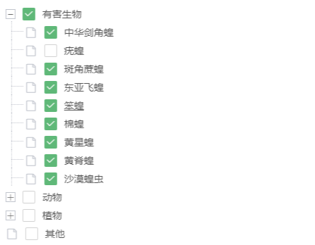

# layui下拉选择器

## 示例：


## 介绍：
基于layui.tree的树形下拉选择组件，支持单选和多选，目前为输入框触发下拉事件，已选值将填入到input中。

## 用法：
```js
layui.use(['customSelect'], function() {
    const select = layui.customSelect
    select.render({
        el: 'searchBox',
        data: list,
        checkbox: true,
        checked: function (obj) {
            console.log(obj)
            //obj.value 已选数据的title
            //obj.data 已选数据
        }
    })
})
```

## 参数：
| 参数名           | 描述                  | 默认值            | 说明                 |
| ---------------- | -------------------- | ----------------- | ---------------------|
| el               | layui下拉选择器的根节点dom的id  | 必填               |               |
| data             | 下拉树的数据          | 必填，每项数据须有title/name/text之一 |  树形多维数据或一维数组，参照layui.tree |
| type             | 类型                 | null              | 若是单选类型，值为'radio'
| line             | 连接线               | true              | 参照layui.tree        |
| accordion        | 是否开启手风琴模式    | false              | 参照layui.tree       |
| checked          | 回调函数             | function           | 下面有说明            |

## 根节点DOM示例：
```html
<div id="参数el的值" style="position: relative">
   <input autocomplete="off" type="text" class="layui-input" placeholder="快速查找" />
</div>
```

## 数据示例（data）：
```js
[{
    title: '江西' //一级菜单
    ,children: [{
      title: '南昌' //二级菜单
      ,children: [{
        title: '高新区' //三级菜单
        //…… //以此类推，可无限层级
      }]
    }]
  },{
    title: '陕西' //一级菜单
    ,children: [{
      title: '西安' //二级菜单
}]
  }]
```

## 回调：
```js
checked: function(data) {
    data.value //已选数据的title
    data.data //已选数据
}
```